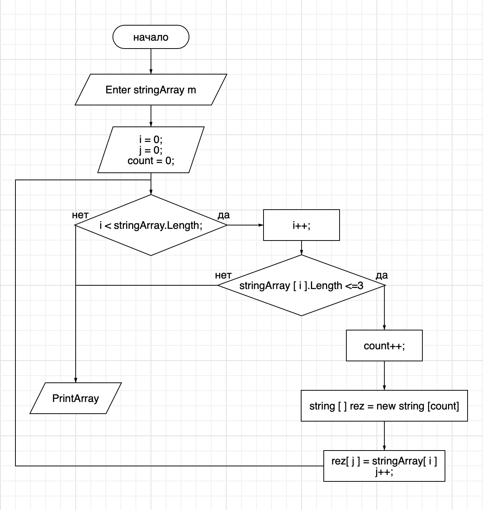

# Инструкция к контрольной работе
1. Создал репозиторий на GitHub.
2. Нарисовал блок-схему алгоритма.
3. Добавил файл с блок-схемой:
4. Добавил оформленный текст с описанием решения (файл README.md).

# Написал программу, решающую поставленную задачу:
* Создаём массив М;
* Вводим переменные i, j, count;
* Создаём цикл;
* Добавляем условие (stringArray[i].Length <=3);
* Выводим результат на печать.

# Использовал контроль версий в работе над этим проектом:
* Использовал команду git add;
* Использовал команду git commit;
* Использовал команду git status;
* Использовал команду git log;
* Использовал команду git git branch;